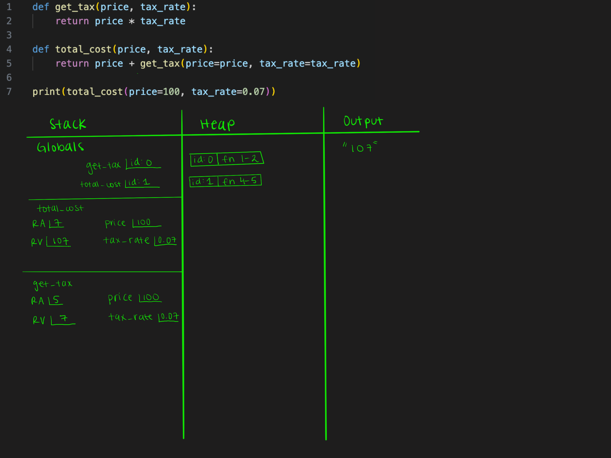
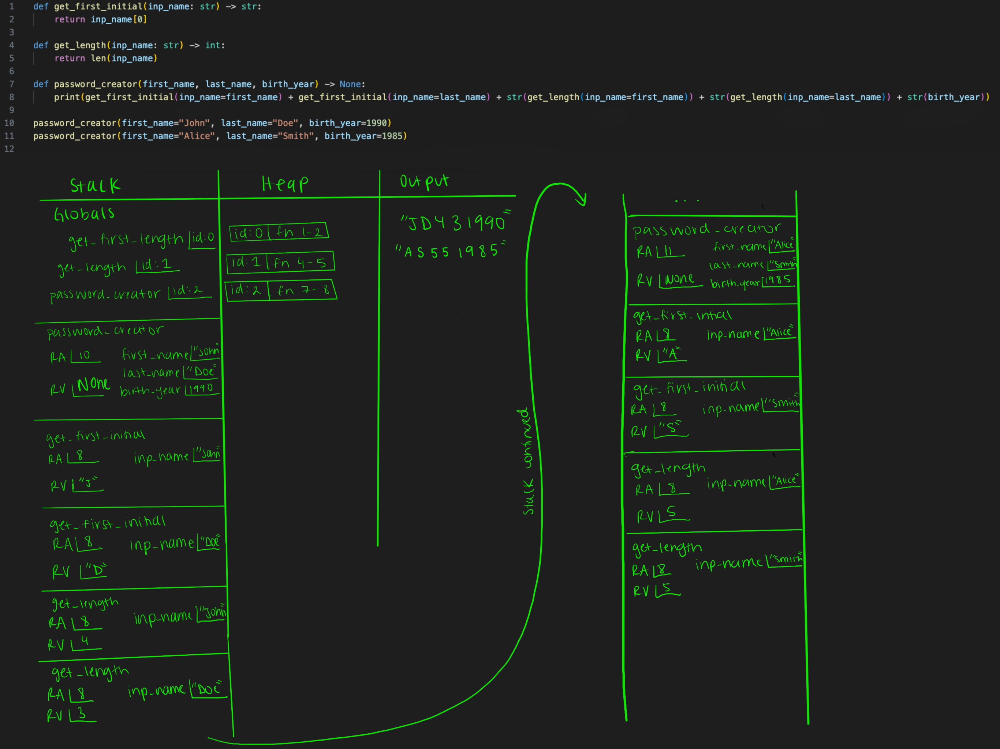

## CQ01

For the following code, please draw a memory diagram. 

1. First code snippet. 

~~~ {.plaintext}
def get_tax(price, tax_rate):
    return price * tax_rate

def total_cost(price, tax_rate):
    return price + get_tax(price=price, tax_rate=tax_rate)

print(total_cost(price=100, tax_rate=0.07))
~~~

2. Second code snippet. 

~~~ {.plaintext}
def get_first_initial(inp_name: str) -> str:
    return inp_name[0]

def get_length(inp_name: str) -> int:
    return len(inp_name)

def password_creator(first_name, last_name, birth_year) -> None:
    print(get_first_initial(inp_name=first_name) + get_first_initial(inp_name=last_name) + str(get_length(inp_name=first_name)) + str(get_length(inp_name=last_name)) + str(birth_year))

password_creator(first_name="John", last_name="Doe", birth_year=1990)
password_creator(first_name="Alice", last_name="Smith", birth_year=1985)
~~~

## The next set of questions will be open-ended responses to see if you understand functions conceptually. If you are unable to spot the error directly, draw the memory diagram for the problem! 

3. Looking at the following code, is there something that stops the intended use of line 4? 

~~~ {.plaintext}
def total_cost(price, tax_rate):
   print(price + (price * tax_rate))

print(total_cost(price=100, tax_rate=0.07))
~~~

    a. No

    b. Yes, line 1

    c. Yes, line 2

    d. Yes, line 3

    e. Yes, line 4

**Solution:** Yes, line 2

First, we need to identify the intended use of line 4, which reads: "printing the `total_cost` when given a price of 100 and a tax_rate of 0.07." The goal here is to print the `total_cost` returned by the `total_cost` function. This implies that the `total_cost` function should return a numeric value representing the total cost.

However, when we examine the function call on line 4, we find that the `total_cost` function does not return a value; instead, it returns `None`. This issue occurs because the function is printing the value within its body rather than returning it. Consequently, we are unable to print the correct total cost of 107 as intended because the function does not provide the expected return value.

To resolve this, the `total_cost` function needs to be modified so that it returns the calculated value rather than printing it directly. This change will allow line 4 to correctly print the total cost.

If you have trouble identifying the error after considering the intended purpose of line 4, creating a memory diagram may help visualize where the problem occurs.

4. Looking at the following code, is there something that stops the intended use of line 5?

~~~ {.plaintext}
def fuel_needed(distance, mpg):
   distance / mpg

def total_fuel_cost(distance, mpg, price_per_gallon):
   return fuel_needed(distance=distance, mpg=mpg) * price_per_gallon

print(total_fuel_cost(distance=300, mpg=25, price_per_gallon=4))
~~~

    a. No

    b. Yes, line 1

    c. Yes, line 2

    d. Yes, line 3

    e. Yes, line 4

    f. Yes, line 5

    g. Yes, line 6

    h. Yes, line 7

**Solution:** Yes, line 2

First, we must identify the intended use of line 7, which reads: "printing the total fuel cost when given a distance of 300, an mpg of 25, and a price per gallon rate of 4." The intention is to print the total fuel cost returned by the `total_fuel_cost` function. This means that the `total_fuel_cost` function must return a numeric value representing the total cost.

Starting from line 7, we observe that the function does indeed have a `return` statement on line 5, which suggests that a value should be returned. However, when we examine line 5 more closely, we see that the `total_fuel_cost` function calls the `fuel_needed` function, passing in the `distance` and `mpg` values. For line 5 to execute correctly, the `fuel_needed` function must return a value that can be multiplied by `price_per_gallon`.

Upon checking the `fuel_needed` function on line 2, we notice that it does not include a `return` statement; it merely performs the calculation `distance / mpg`. Without a `return` statement, the `fuel_needed` function does not return a value, which means that line 5 cannot complete its operation, resulting in the failure to execute the intended use of line 7. If you have difficulty identifying the error after considering the intended purpose of line 7, creating a memory diagram may help visualize the issue.

5. Looking at the following code, is there something that stops the intended use of line 7?

~~~ {.plaintext}
def fuel_needed(distance, mpg):
   return distance / mpg

def total_fuel_cost(distance, mpg, price_per_gallon):
   print(fuel_needed(distance=distance, mpg=mpg) * price_per_gallon)

total_fuel_cost(distance=300, mpg=25, price_per_gallon=4)
~~~

    a. No

    b. Yes, line 1

    c. Yes, line 2

    d. Yes, line 3

    e. Yes, line 4

    f. Yes, line 5

    g. Yes, line 6

    h. Yes, line 7

**Solution:** No